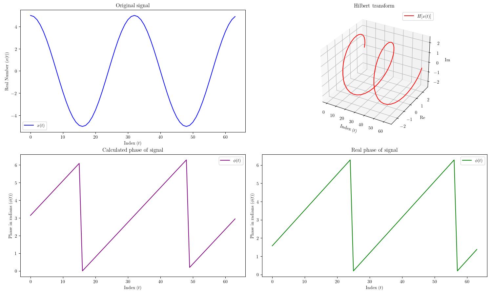

# Hilbert Transform Demo

run `./scripts/script.sh` to:
- compile `ht.c`
- run it as `prog` and write its output to `output.txt` 
- run `plot.py` on `output.txt` to visualize x(t) and phi(t)

*if there is a linker error from* `./scripts/script.sh`*, try* `./scripts/harry_script.sh`
